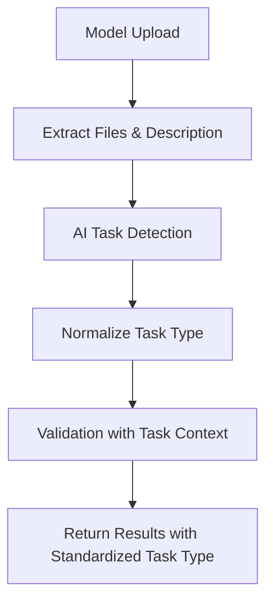

# Task Type Mapping System

This document explains the task type mapping system implemented in the modelValidator project to ensure consistency between AI-detected task types and standardized task type templates.

## Problem Solved

Previously, AI might detect task types in various formats:
- `image_generation` (AI detection)
- `image-generation` (template format) 
- `Image Generation` (user description)

This inconsistency made it difficult to match detected tasks with standardized templates. Our solution ensures all variations map to consistent, standardized task types.

## System Architecture

### 1. Core Components

#### `/app/task_types.py`
- **`TASK_TYPES`**: List of 35 standardized task types
- **`TASK_TYPE_MAPPING`**: Dictionary mapping AI variations to standard types
- **`normalize_task_type()`**: Function to convert AI detections to standard format
- **`get_task_type_suggestions()`**: Function to get relevant task types by query

#### `/app/validator.py`
- **`detect_task_type()`**: Uses AI to detect task type from model info
- **`validate_model_with_ai()`**: Enhanced validation including task type detection

### 2. Workflow



## Standardized Task Types

### Available Task Types (35 total)

#### Image Tasks
- `image-classification` - Classify images into categories
- `object-detection` - Detect and locate objects in images
- `image-generation` - Generate images from text (Stable Diffusion, DALL-E)
- `image-segmentation` - Segment images into regions
- `image-to-text` - Extract text from images (OCR, captioning)
- `visual-question-answering` - Answer questions about images
- `depth-estimation` - Estimate depth from images

#### Text Tasks
- `text-generation` - Generate text (GPT, LLMs)
- `text-classification` - Classify text into categories
- `sentiment-analysis` - Analyze sentiment/emotions
- `translation` - Translate between languages
- `question-answering` - Answer questions from context
- `summarization` - Summarize long texts
- `named-entity-recognition` - Extract entities (names, places)
- `token-classification` - Classify individual tokens
- `zero-shot-classification` - Classify without training examples
- `fill-mask` - Fill masked tokens in text
- `language-modeling` - General language modeling
- `text2text-generation` - Text-to-text transformation
- `conversational` - Chatbots and dialogue systems
- `feature-extraction` - Extract text embeddings

#### Audio Tasks
- `speech-to-text` - Convert speech to text (ASR)
- `text-to-speech` - Convert text to speech (TTS)
- `automatic-speech-recognition` - Advanced speech recognition
- `audio-classification` - Classify audio content
- `voice-activity-detection` - Detect speech activity

#### Specialized Tasks
- `video-classification` - Classify video content
- `table-question-answering` - Answer questions about tables
- `document-question-answering` - Answer questions about documents
- `tabular-classification` - Classify tabular data
- `tabular-regression` - Regression on tabular data
- `time-series-forecasting` - Predict future time series values
- `reinforcement-learning` - RL models and agents
- `robotics` - Robot control and navigation
- `graph-ml` - Graph neural networks

## Task Type Mapping Examples

### AI Detection → Standardized Format

```python
# Image tasks
"image_classification" → "image-classification"
"Image Classification" → "image-classification"  
"classify images" → "image-classification"
"YOLO" → "object-detection"
"diffusion" → "image-generation"
"stable diffusion" → "image-generation"
"OCR" → "image-to-text"

# Text tasks
"GPT" → "text-generation"
"large language model" → "text-generation"
"LLM" → "text-generation"
"chatbot" → "conversational"
"sentiment analysis" → "sentiment-analysis"
"translate" → "translation"
"QA" → "question-answering"

# Audio tasks
"speech to text" → "speech-to-text"
"ASR" → "automatic-speech-recognition"
"TTS" → "text-to-speech"
"voice synthesis" → "text-to-speech"
```

## API Response Format

When uploading a model, the API now returns:

```json
{
  "status": "VALID",
  "framework_used": "PyTorch",
  "task_detection": {
    "task_type": "image-classification",
    "confidence": "high",
    "reasoning": "Model files and description indicate image classification task",
    "original_detection": "image_classification"
  }
}
```

### Response Fields

- **`status`**: Validation result (`VALID`, `INVALID`, `ERROR`)
- **`framework_used`**: Detected ML framework
- **`task_detection.task_type`**: Standardized task type
- **`task_detection.confidence`**: AI confidence level (`high`, `medium`, `low`)
- **`task_detection.reasoning`**: AI explanation for detection
- **`task_detection.original_detection`**: Original AI detection before normalization

## Usage Examples

### Testing Task Type Mapping

```python
from app.task_types import normalize_task_type, get_task_type_suggestions

# Normalize AI detections
normalize_task_type("image_classification")  # → "image-classification"
normalize_task_type("GPT")                   # → "text-generation"
normalize_task_type("YOLO")                  # → "object-detection"

# Get suggestions
get_task_type_suggestions("image")  # → ["image-classification", "image-generation", ...]
```

### API Testing

```bash
# Test with curl
curl -X POST "http://localhost:8000/model-upload" \
  -H "Content-Type: multipart/form-data" \
  -F "file=@model.zip" \
  -F "model_name=My Image Classifier" \
  -F "model_setUp=Load with PyTorch and use for image classification" \
  -F "description=This model classifies images into different categories"
```

## Benefits

1. **Consistency**: All task types are standardized across the system
2. **Flexibility**: AI can detect variations, but they map to standard types
3. **Maintainability**: Easy to add new mappings or task types
4. **Integration**: Frontend can rely on consistent task type names
5. **Intelligence**: AI understands context and provides confidence levels

## Future Enhancements

1. **Auto-learning**: Add new mappings based on common AI detections
2. **Confidence thresholds**: Set minimum confidence for task detection
3. **Multi-task detection**: Support models that perform multiple tasks
4. **Task-specific validation**: Different validation rules per task type
5. **Framework-task compatibility**: Check if framework supports detected task type

## Files Modified

- `/app/task_types.py` - Core task type system
- `/app/validator.py` - Enhanced validation with task detection  
- `/app/routes.py` - Updated API response format
- `/test_task_types.py` - Test script for task mapping system